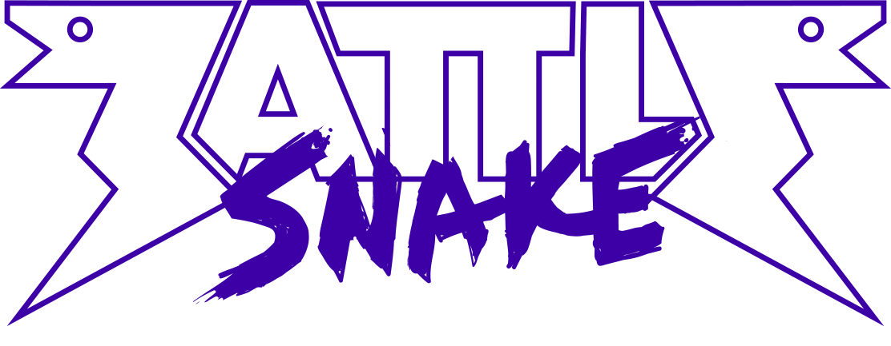

# Battlesnake 2020 AI


This is my entry for [Battlesnake](https://www.battlesnake.io) 2020 programming competition in Victoria BC being held on March 2, 2020.

Forked from the [NodeJS starter snake](https://github.com/battlesnakeio/starter-snake-node) provided by the [Battlesnake community](https://github.com/battlesnakeio/community).

## Running the snake locally
Follow the directions given on the [Battlesnake Docs](http://docs.battlesnake.io/zero-to-snake-linux.html) in the Zero to Snake section for your operating system. When you get to the point where it tells you to clone the starter snake, you can clone this snake instead if you wish.
```shell
git clone git://github.com/tyrelh/battlesnake2020.git
```
You can also deploy this repo directly to Heroku by clicking this link. You will need a Heroku account to do this.

[](https://heroku.com/deploy)

## Resources
* [Battlesnake Homepage](https://www.battlesnake.io/)
* [Battlesnake 2019 API](http://docs.battlesnake.io/snake-api.html)
* [Battlesnake Docs](http://docs.battlesnake.io)
* [Battlesnake NodeJS Starter Snake](https://github.com/battlesnakeio/starter-snake-node)
* [My 2018 Python Entry](https://github.com/tyrelh/battlesnake2018)

## Changelog
* v3.4:
    * Distance calculations for closest enemy, kill opportunity, and food use an exponentially decreasing score calculation with distance.
* v3.3:
    * Testing framework! Can now test individual move calls in `/tests` by running `./test`.
    * Eating now sums scores by distance to all foods.
    * Hunting will now search all possible hunting paths and sum scores for moves.
* v3.2:
    * Danger snake distance and killable snake distance calculations now measure all snakes, not just closest one.
    * If 1 enemy remains will not try to be bigger, will hunt its FUTURE_2 positions.
    * Will hunt if there are any snakes smaller. Wont always try to be the biggest snake if there are multiple enemies remaining.
    * Fix bug in edgeFill where DANGER zones were being marked KILL zones.
    * Now logging JSON data for each turn.
* v3.1:
    * Will treat a snake with the same name (another copy/version of me) as a danger snake to avoid killing self.
    * Properly marks new tail locations when advancing snake positions.
    * More accurately scores all possible moves based on distance from dangerous enemy heads, distance to killable enemy heads, and distance from wall.
* v3.0:    
    * Refactored A* search to be more modular.
    * Refactored non-behaviour searches to be more modular.
* v2:
  * [2019 entry written in JavaScript/Node](https://github.com/tyrelh/battlesnake2019), ported from my 2018 entry.
  
* v1:
  * [2018 entry written in Python](https://github.com/tyrelh/battlesnake2018).

## TODO
* Board control metric. Score moves by area of board you are gaining or enemies are loosing.

_*The header image used in this readme is the property of [Battlesnake](https://www.battlesnake.io/)._